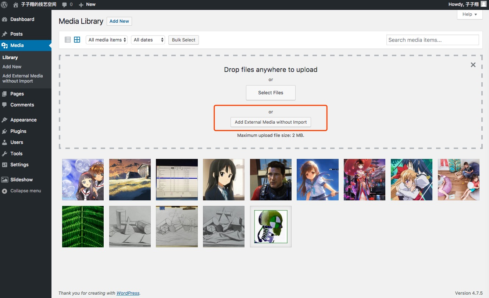
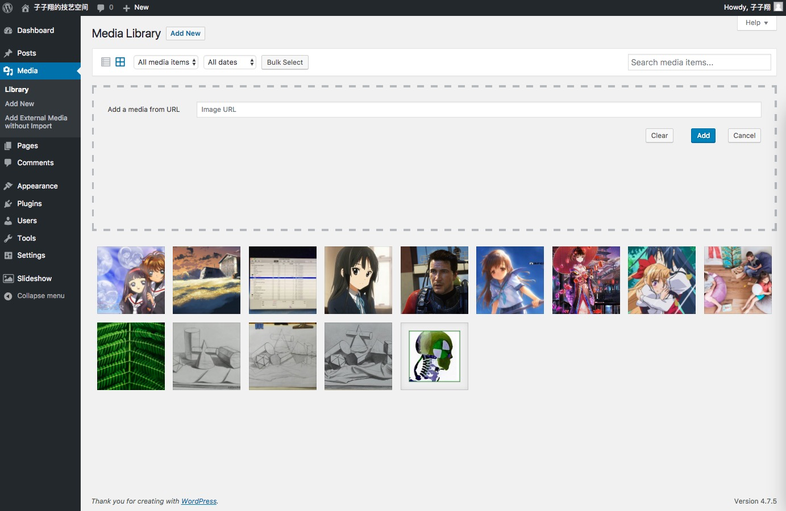

External Media without Import
============================================================================ 
By default, adding an image to the WordPress media library requires you to import or upload the image to the WordPress site, which means there must be a copy of the image file stored in the site. This plugin enables you to add an image stored in an external site to the media library by just adding a URL linking to the remote image address. In this way you can host the images in a dedicated server other than the WordPress site, and still be able to show them by various gallery plugins which only take images from the media library.

The plugin provides buttons and inputs in the 'Media' -> 'Add New' page, the media upload panel and a dedicated Add External Media without Import submenu page. Therefore you can either add an external media before (or after) editing any post or page, or in the process of editing a post or page without interrupting the editing process.

## Installation

1. Upload the plugin files to the `/wp-content/plugins/external-media-without-import` directory, or install the plugin through the WordPress plugins screen directly.
2. Activate the plugin through the 'Plugins' screen in WordPress.

Then you can use the plugin to add external media wihtout import.

## Usage

Click the 'Add New' button in the 'Media' -> 'Library' page, the media upload panel will show up, in which there's an 'Add External Media without Import' button. Click it.

If the Library page is in grid mode, the 'Add a media from URL' panel will appear.

If the Library page is in list mode, clicking 'Add External Media without Import' in the upload panel directs you to the 'Add External Media without Import' submenu page, which can also be accessed by clicking 'Media' -> 'Add External Media without Import' in the admin menu. The input interface of the submenu page is the same as that in grid mode.

Fill in the URL and click the 'Add' button, the remote image will be added.

You can also add an external media during the process of editing a post or page by clicking 'Add Media' -> 'Upload Files', and in the upload panel click 'Add External Media without Import'. The same input interface will appear.

Note that WordPress needs to know in advance the width and height of an image in order to correctly display it in the media library page and any post/page. In most cases, the plugin resolves these properties automatically without worrying you. But in rare cases, the plugin may fail to get the width and height of the image you specify when you click 'Add' in the 'Add a media from URL' panel. In that case, some input fields will show up and let you fill in the properties manually.

## Changelog

**Version 1.0.2.1**

Just changed te readme file, the changelog in previous readme file seems not work.

**Version 1.0.2**

Fixed XSS Security Vulnerabilities and bug with mime types including '+' such as 'image/svg+xml'.

Thank [Mike Vastola](https://github.com/mvastola).

[Click to see detailed information of this bug](https://github.com/zzxiang/external-media-without-import/pull/3).

**Version 1.0.1**

Fixed a bug which causes HTTP 500 - internal server error.

The error occurs in previous version when the plugin fails to get the image size and MIME type. The HTTP 500 error causes the plugin message not correctly displayed in the media upload panel. It also causes the Add External Media without Import page broken.
